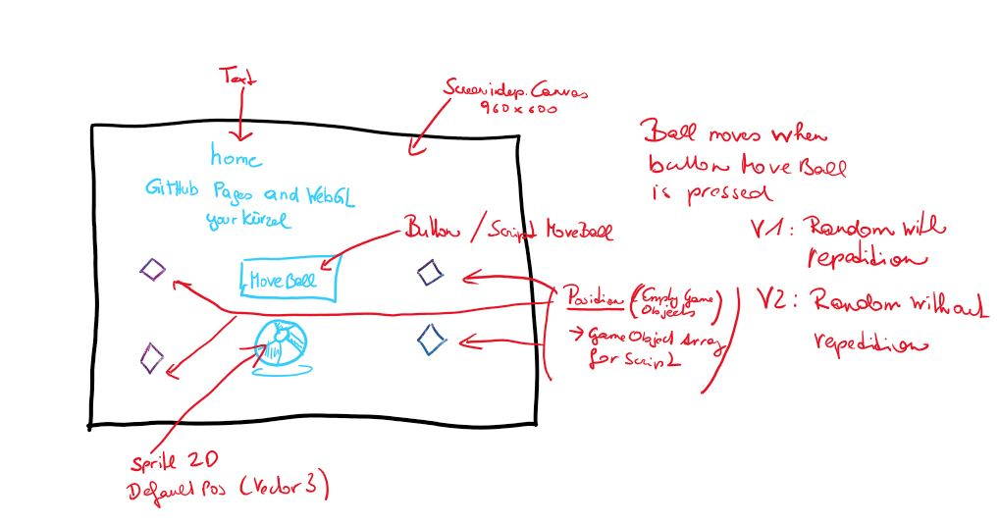

# home-WebGL-movingBall-smeerws

### Project description: 
This simple project consists of a screenindependent canvas (960x600), 
a button (MoveBall), a text (title with developer name), a script (moving the ball with the button), 
and a gameobject ball (sprite2d imported)

When pressing the button "Move Ball" the ball moves randomly to a new position. 
4 Positions are available (4 Empty GameObjects PosBottomLeft, PosBottomRight, PosTopLeft, PosTopRight).
There are 2 different variations for moving the ball to the positions randomly.
* Variation 1: direct repetition of the randomly chosen position is possible.
* Variation 2: the randomly chosen position is always different, i.e. new position != old position  

### Development platform: 
* Windows 10; 
* Unity Version: 2019.1.14f1; 
* Visual Studio Version: Microsoft Visual Studio Community 2017, Version 15.9.17;
* Scripting Runtime Version: 4.X;

### Target platform: 
WebGL incl. reference resolution 960x600 

### Visuals: 

<a href="https://5ahmnm1920mtin-3h.github.io/home-WebGL-movingBall-smeerws/">Reference WebGL Build from moving ball</a>

### Necessary setup/execution steps: 
Installation process, e.g. step by step instructions that I can run the project after cloning it

### Third party material: 
(if used Fonts, Sounds, Music, Graphics, Materials, Code etc.)
<a href="https://de.freepik.com/fotos-vektoren-kostenlos/sport">Sport Vektor erstellt von kreativkolors - de.freepik.com</a>
### Project state: 
incl. progress in percent

### Limitations: 
None

### Lessons Learned: 
* Generate and use Random numbers
* Use a Script in combination with a button
* Build for the WebGL platform
* Publish a WebGL project on GitHub Pages via folder docs

Copyright by you smeerws
